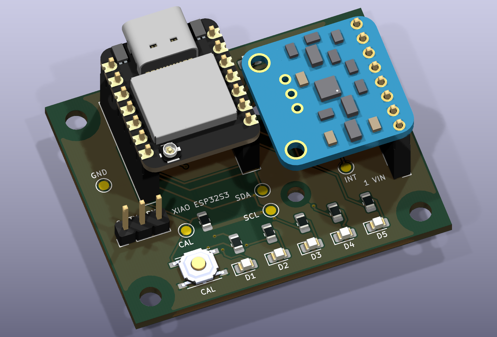

# Vibra V1

Carte détecteur de vibrations autour d’un **Seeed XIAO ESP32S3** et d’un **LIS3DH sur breakout Adafruit**, conçue pour être assemblée au fer à souder.



**Révision E-HS · 48 × 38 mm · 2 couches · FR-4 1,6 mm · KiCad 10.0.6**

## Commencer

1. Télécharger le dépôt avec **Code → Download ZIP**, puis extraire le dossier, ou le cloner.
2. Ouvrir **[`Vibra_V1.kicad_pro`](Vibra_V1.kicad_pro)** dans KiCad 10.0.6 ou ultérieur. Les symboles, empreintes et modèles 3D sont inclus ; conserver leur organisation.
3. Lire le **[guide de montage](docs/GUIDE_MONTAGE.md)** et vérifier les modules réels avant de faire fabriquer le PCB.

| Document | Contenu |
|---|---|
| [Schéma PDF](docs/Vibra_V1_schematic.pdf) | Circuit complet sur une page A4 |
| [Plan d’assemblage ×4](docs/Vibra_V1_assembly_x4.pdf) | Repères lisibles pour la soudure |
| [Plan à l’échelle 1:1](docs/Vibra_V1_assembly.pdf) | Essai à blanc, impression à 100 % sans ajustement |
| [Liste d’achat](fabrication/rev_E/LISTE_ACHAT.csv) | Composants regroupés par référence fabricant |
| [BOM détaillée](fabrication/rev_E/Vibra_V1_BOM.csv) | Valeurs, empreintes et références par composant |
| [Brochage](docs/PINOUT.md) | XIAO, LIS3DH, UART et affectation des GPIO |
| [Revue technique](docs/REVUE_E-HS.md) | Contrôles, règles et limites de validation |
| [Assemblage STEP](docs/Vibra_V1_assembly.step) | Modèle mécanique avec breakout simplifié |

## La carte

- Cinq LED rouges, bouton CAL et connecteur UART à trois broches, sans alimentation.
- Alimentation et programmation par l’USB-C du XIAO, orienté vers l’extérieur du PCB.
- Résistances, condensateurs et LED en **0805 à grandes pastilles** ; bouton PTS526 ; supports traversants au pas de 2,54 mm.
- **Pistes GND et 3,3 V de 0,6 mm**, plans de masse sur les deux faces et liaisons thermiques GND de 0,6 mm.
- Quatre trous M3 pour la porteuse et deux trous de 2,5 mm pour fixer le breakout avec de la visserie M2.

Le **5 V reste dans le XIAO**. La porteuse utilise sa sortie 3,3 V ; la broche 5V/VBUS est volontairement isolée. RESET et BOOT sont les boutons du XIAO ; CAL est un bouton distinct. L’antenne fournie se branche au connecteur U.FL du XIAO.

## Compatibilité et état du prototype

**Le capteur prévu est l’ancien Adafruit LIS3DH 2809 à une seule rangée de 8 broches**, dans l’ordre VIN, 3Vo, GND, SCL, SDA, SDO, CS, INT. La version récente STEMMA QT ne convient pas. Le LIS3DH est déjà soudé sur le breakout : aucune puce LGA à souder à la main.

Les contrôles de la révision E-HS donnent **ERC 0, DRC 0, aucune liaison non routée, aucun écart schéma/PCB et 71/71 associations broche–réseau concordantes**. Les rapports et paramètres de contrôle sont [inclus](fabrication/rev_E/reports/).

**La validation physique reste à faire** : confirmer la révision du breakout acheté, vérifier les connecteurs et entretoises à blanc, puis tester le premier exemplaire. Aucun firmware de détection/calibration validé n’est fourni. Les fichiers de fabrication ne constituent pas à eux seuls un accord de commande.

## Organisation

```text
Vibra_V1.kicad_*       Projet, schéma, PCB et règles de largeur
Vibra.kicad_sym        Symboles locaux
Vibra_Reviewed.pretty/ Empreintes locales
packages3D/           Modèles STEP des composants
model_source/         Source Adafruit et générateur du modèle simplifié
docs/                 Montage, brochage, schéma, plans et rendus
fabrication/rev_E/    BOM, Gerbers, perçages, placement et rapports
licenses/             Attribution et licence des éléments tiers
```

Les fichiers de fabrication correspondent exclusivement à **Rev E-HS**. Lire [`LIRE_AVANT_COMMANDE.txt`](fabrication/rev_E/LIRE_AVANT_COMMANDE.txt). Le PCB requiert des trous métallisés : le projet vise une fabrication du PCB par un fabricant et un assemblage à domicile.

## Modifier et vérifier

Conserver ensemble le schéma, le PCB et les bibliothèques locales. Après modification, mettre à jour le PCB depuis le schéma, remplir les zones puis relancer **ERC et DRC avec vérification de parité** dans KiCad. Régénérer les sorties de fabrication si la conception change ; ne pas envoyer d’anciens Gerbers avec un PCB modifié.

Pour refaire les contrôles en ligne de commande, depuis ce dossier avec `kicad-cli` dans le PATH :

```sh
mkdir -p build
kicad-cli sch erc --format json -o build/ERC.json Vibra_V1.kicad_sch
kicad-cli pcb drc --refill-zones --schematic-parity --format json -o build/DRC.json Vibra_V1.kicad_pcb
```

Le générateur facultatif `model_source/breakout_model.py` dépend de Python et de `cadquery-ocp`. Le modèle STEP est déjà fourni ; sa régénération n’est pas nécessaire pour ouvrir ou fabriquer le projet.

## Sources et droits

Projet adapté à partir du projet KiCad existant et des composants du modèle pédagogique. Les [sources détaillées](docs/SOURCES.md) identifient les éléments Seeed, Adafruit, C&K et KiCad. L’adaptation 3D Adafruit est distribuée sous [CC BY-SA 3.0](licenses/Adafruit_CC_BY_SA_3.0.txt), avec sa [notice d’attribution](licenses/Adafruit_model_NOTICE.md).

Aucune licence globale supplémentaire n’est accordée par ce dépôt ; les éléments tiers conservent leurs licences et attributions respectives.
